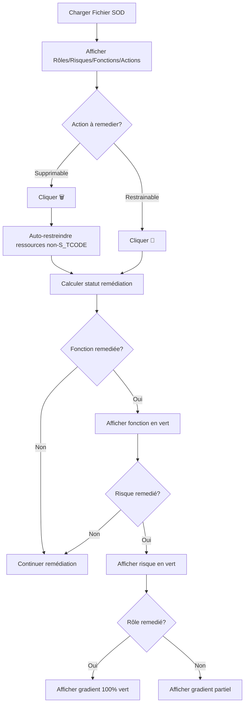

# Système de Remédiation SOD

## 📋 Vue d'Ensemble

Le système de remédiation SOD permet de visualiser et suivre la progression de la remédiation des risques, fonctions et rôles en temps réel avec des indicateurs visuels clairs.

## 🎯 Concepts Clés

### Actions Remediables

Une action est considérée comme **REMEDIABLE** si elle possède au moins l'une de ces caractéristiques :

#### 1. Action SUPPRIMABLE
- **Définition** : Action qui contient une ressource `S_TCODE`
- **Remédiation** : Supprimer l'action (bouton 🗑️)
- **Effet visuel** : Fond rose
- **Effet technique** : 
  - Action marquée comme `isDeleted = true`
  - Ressources non-S_TCODE automatiquement restreintes

#### 2. Action RESTRAINABLE
- **Définition** : Action qui contient au moins une ressource NON-S_TCODE
- **Remédiation** : Restreindre l'action ou ses ressources (bouton 🚫)
- **Effet visuel** : Fond beige/orange
- **Effet technique** : Action marquée comme `isRestricted = true`

### Hiérarchie de Remédiation

```
Rôle
 ├─ Risque 1
 │   ├─ Fonction A
 │   │   ├─ Action 1 (supprimable)
 │   │   └─ Action 2 (restrainable)
 │   └─ Fonction B
 │       └─ Action 3 (supprimable + restrainable)
 └─ Risque 2
     └─ ...
```

## 🔢 Logique de Calcul

### Fonction Remediée

Une fonction est **REMEDIEE** si **AU MOINS UNE** de ces conditions est vraie :

1. **Toutes les actions SUPPRIMABLES sont supprimées**
   ```
   Fonction avec :
   - 5 actions supprimables (avec S_TCODE)
   - 5 actions supprimées
   → Fonction REMEDIEE ✅
   ```

2. **Toutes les actions RESTRAINABLES sont restreintes**
   ```
   Fonction avec :
   - 7 actions restrainables (avec ressources non-S_TCODE)
   - 7 actions restreintes
   → Fonction REMEDIEE ✅
   ```

**Exemple Pratique** :
```typescript
Fonction BAS-BS11 :
- SM12, SM13, SM50, SM51, SM59 : supprimables (5)
- Toutes les 7 actions : restrainables (7)

État actuel :
- 5/5 supprimées ✅
- 5/7 restreintes ❌

Résultat : REMEDIEE ✅ (condition 1 suffit)
```

### Risque Remedié

Un risque est **REMEDIE** si **AU MOINS UNE** de ses fonctions est remediée.

**Indicateurs visuels** :
- ✅ Fond vert clair : `alpha(success.main, 0.05)`
- ✅ Bordure verte : `alpha(success.main, 0.3)`
- ✅ Badge "Remedié" avec icône ✓

### Rôle Remedié

Un rôle est **REMEDIE** si **TOUS** ses risques sont remediés.

**Indicateurs visuels** :
- ✅ Gradient progressif dans l'en-tête : vert (remédié) → bleu (non remédié)
- ✅ Badge avec pourcentage : "75% Remedié"
- ✅ Bordure verte épaisse (6px) si 100% remedié
- ✅ Bordure de carte verte (2px) si 100% remedié

**Calcul du pourcentage** :
```typescript
remediationPercentage = (remediatedRisks / totalRisks) * 100

Exemple :
- 3 risques remediés sur 4
- 3/4 × 100 = 75%
```

## 🎨 Indicateurs Visuels

### Action

| État | Fond | Badge 🟢 (S_TCODE) | Badge 🟠 (Permissions) | Boutons |
|------|------|-------------------|----------------------|---------|
| **Normale** | Blanc | Bleu | Orange | 🗑️ ✅  🚫 ✅ |
| **Supprimée** | Rose | Gris | Gris | 🗑️ ✅  🚫 ❌ |
| **Restreinte** | Beige | Bleu | Gris | 🗑️ ❌  🚫 ✅ |

### Ressources sous une Action Supprimée

| Ressource | Fond | État |
|-----------|------|------|
| **S_TCODE** | Rose | Supprimée avec l'action |
| **S_C_FUNCT** | Beige/Orange | Restreinte automatiquement |
| **S_ENQUE** | Beige/Orange | Restreinte automatiquement |
| **S_ADMLFCD** | Beige/Orange | Restreinte automatiquement |

### Risque

```
┌─────────────────────────────────────┐
│ ⚠️ BAS-B009 [✅ Remedié] 🟢         │ ← Fond vert + Badge
│   Description du risque             │
├─────────────────────────────────────┤
│  Fonction A (remediée)              │
│  Fonction B (remediée)              │
└─────────────────────────────────────┘
```

### Rôle

```
┌──────────────────────────────────────┐
│ 🟢▓▓▓▓▓▓░░░░│ 👤 ROLE_SIMPLE_A      │ ← Gradient 75%
│              │   [75% Remedié]       │ ← Badge
├──────────────────────────────────────┤
│  ⚠️ Risk-001 [✅ Remedié] 🟢        │
│  ⚠️ Risk-002                         │
│  ⚠️ Risk-003 [✅ Remedié] 🟢        │
│  ⚠️ Risk-004 [✅ Remedié] 🟢        │
└──────────────────────────────────────┘
```

## 🔧 Propagation Automatique

### Comportement lors de la Suppression

Quand on **supprime une action** (clic sur 🗑️) :

1. **Action marquée comme supprimée**
   ```typescript
   deletedActionsRef.set(key, true)
   ```

2. **Ressources NON-S_TCODE automatiquement restreintes**
   ```typescript
   resources.forEach(resource => {
     if (resource.code !== 'S_TCODE') {
       // Ajouter les valeurs à restrictedResourcesRef
     }
   });
   ```

3. **Mise à jour visuelle**
   - Action : fond rose
   - S_TCODE : fond rose
   - Autres ressources : fond beige/orange

### Comportement lors de la Restauration

Quand on **restaure une action** (clic sur 🗑️ à nouveau) :

1. **Action retirée des supprimées**
   ```typescript
   deletedActionsRef.delete(key)
   ```

2. **Ressources NON-S_TCODE automatiquement dé-restreintes**
   ```typescript
   resources.forEach(resource => {
     if (resource.code !== 'S_TCODE') {
       // Retirer les valeurs de restrictedResourcesRef
     }
   });
   ```

3. **Retour à l'état initial**

## 🚫 Règles de Priorité

### Règle 1 : Suppression > Restriction

**Une action SUPPRIMÉE ne peut JAMAIS être RESTREINTE**

```typescript
// Dans applyStateToAction
const finalIsRestricted = isDeleted 
  ? false  // ✅ Priorité à isDeleted
  : (/* logique normale de restriction */)
```

**Conséquence** :
- `isDeleted = true` → `isRestricted = false` (toujours)
- Bouton 🗑️ reste actif pour permettre la restauration
- Action ne figure pas dans le panneau "Actions Restreintes"

### Règle 2 : Distinction Visuelle des Ressources

**Seul S_TCODE hérite de l'état "supprimé"**

```typescript
// Dans SodActionItem
const enhancedResource = {
  ...resource,
  isDeleted: isDeleted && resource.code === 'S_TCODE',
  isRestricted: resource.isRestricted,
};
```

**Logique** :
- S_TCODE = la transaction → supprimée complètement
- Autres ressources = permissions → restreintes (pas supprimées du système)

## 📊 Panneaux de Debug

### Actions Restreintes

```
🚫 Actions Restreintes (9)

SAP_ABAP_CHANNELS_ADMIN → SM12    [🚫 Directe] [🔗 Propagation]
SAP_ABAP_CHANNELS_ADMIN → SM13    [🚫 Directe] [🔗 Propagation]
...
```

**Note** : Les actions **supprimées** n'apparaissent PAS dans ce panneau.

### Ressources Restreintes

```
🔒 Ressources Restreintes (4)

SAP_ABAP_CHANNELS_ADMIN → S_C_FUNCT → ACTVT
  16

SAP_ABAP_CHANNELS_ADMIN → S_ENQUE → S_ENQ_ACT
  ALL | DLFU | DLOU

...
```

## 💻 Implémentation Technique

### Types TypeScript

```typescript
// lib/types/sodAnalysis.ts

export interface FunctionRemediationStatus {
  isRemediated: boolean;
  totalActions: number;
  remediatedActions: number;
}

export interface RiskRemediationStatus {
  isRemediated: boolean;
  totalFunctions: number;
  remediatedFunctions: number;
  remediationPercentage: number; // 0-100
}

export interface RoleRemediationStatus {
  isRemediated: boolean;
  totalRisks: number;
  remediatedRisks: number;
  remediationPercentage: number; // 0-100
}
```

### Fonctions de Calcul

```typescript
// lib/contexts/SodActionsContext.tsx

const calculateFunctionRemediation = useCallback((
  roleName: string, 
  actions: any[]
) => {
  let suppressableCount = 0;
  let suppressedCount = 0;
  let restrainableCount = 0;
  let restrictedCount = 0;
  
  // Parcourir les actions et compter...
  
  const allSuppressablesSuppressed = 
    suppressableCount > 0 && suppressedCount === suppressableCount;
  const allRestrainablesRestricted = 
    restrainableCount > 0 && restrictedCount === restrainableCount;
  
  return {
    isRemediated: allSuppressablesSuppressed || allRestrainablesRestricted,
    totalActions: Math.max(suppressableCount, restrainableCount),
    remediatedActions: Math.max(suppressedCount, restrictedCount)
  };
}, [getActionKey, getResourceKey]);
```

### Utilisation dans les Composants

```typescript
// lib/components/sod/display/SodRiskSection.tsx

const remediationStatus = useMemo(
  () => actionsContext.calculateRiskRemediation(roleName || '', functions),
  [roleName, functions, actionsContext.version, actionsContext.calculateRiskRemediation]
);

// Appliquer le style
<Paper
  sx={{
    backgroundColor: remediationStatus.isRemediated 
      ? alpha(theme.palette.success.main, 0.05)
      : 'transparent',
    border: `1px solid ${
      remediationStatus.isRemediated 
        ? alpha(theme.palette.success.main, 0.3)
        : /* couleur par niveau */
    }`
  }}
>
```

## 🎯 Cas d'Usage

### Cas 1 : Remédiation par Suppression

**Objectif** : Remedier une fonction en supprimant toutes les actions supprimables

1. Identifier les actions avec S_TCODE
2. Cliquer sur 🗑️ pour chaque action
3. Les ressources non-S_TCODE sont automatiquement restreintes
4. Quand toutes sont supprimées → Fonction remediée ✅

### Cas 2 : Remédiation par Restriction

**Objectif** : Remedier une fonction en restreignant toutes les actions restrainables

1. Identifier les actions avec ressources non-S_TCODE
2. Cliquer sur 🚫 pour chaque action (ou restreindre les ressources individuellement)
3. Quand toutes sont restreintes → Fonction remediée ✅

### Cas 3 : Remédiation Mixte

**Objectif** : Combiner suppression et restriction

1. Supprimer les actions supprimables (avec S_TCODE)
2. Restreindre les actions restrainables (avec autres ressources)
3. Dès qu'une catégorie est 100% → Fonction remediée ✅

## 🐛 Dépannage

### Problème : Action supprimée mais bouton désactivé

**Cause** : Action marquée comme restreinte en plus de supprimée

**Solution** : Vérifier la règle de priorité dans `sodStateApplication.ts` :
```typescript
const finalIsRestricted = isDeleted ? false : (/* ... */)
```

### Problème : Ressources en rose au lieu de beige

**Cause** : Toutes les ressources héritent de `isDeleted`

**Solution** : Vérifier dans `SodActionItem.tsx` :
```typescript
isDeleted: isDeleted && resource.code === 'S_TCODE'
```

### Problème : Actions supprimées dans "Actions Restreintes"

**Cause** : Le calcul de `allRestrictedActions` ne filtre pas les actions supprimées

**Solution** : Ajouter le filtre dans `page.tsx` :
```typescript
const isDeleted = isActionDeleted(role.roleName, action.code);
if (isDeleted) return;
```

## 📈 Optimisations de Performance

### Mémoïsation des Calculs

```typescript
const remediationStatus = useMemo(
  () => actionsContext.calculateRoleRemediation(roleName, risks),
  [roleName, risks, actionsContext.version, actionsContext.calculateRoleRemediation]
);
```

**Bénéfices** :
- Calculs uniquement quand nécessaire
- Dépendance à `actionsContext.version` pour forcer le recalcul lors des changements
- Pas de re-render inutiles

### Maps en O(1)

```typescript
const deletedActionsRef = useRef<Map<string, boolean>>(new Map());
const restrictedActionsRef = useRef<Map<string, { restrictedByAction: boolean }>>(new Map());
const restrictedResourcesRef = useRef<Map<string, Set<string>>>(new Map());
```

**Bénéfices** :
- Recherche instantanée avec des clés uniques
- Modifications en place (pas de copie)
- Gestion efficace de gros volumes

## 🔄 Workflow Complet



## 📝 Notes Importantes

1. **Persistance** : Les états de remédiation ne sont PAS sauvegardés automatiquement. Ils sont recalculés en temps réel.

2. **Compatibilité** : Le système fonctionne pour les rôles simples (ÉTAPE 1). L'extension aux rôles composites (ÉTAPE 2) est à venir.

3. **Performance** : Optimisé pour gérer des milliers d'actions grâce aux Maps et à la mémoïsation.

4. **Évolutivité** : L'architecture permet d'ajouter facilement de nouveaux critères de remédiation.

## 🚀 Prochaines Étapes

- [ ] Étendre le système aux rôles composites (ÉTAPE 2)
- [ ] Ajouter la sauvegarde des états de remédiation
- [ ] Implémenter l'export des rapports de remédiation
- [ ] Ajouter des filtres par statut de remédiation
- [ ] Historique des actions de remédiation

---

**Dernière mise à jour** : 2025-01-06
**Version** : 1.0.0
**Auteur** : Équipe Artimis

